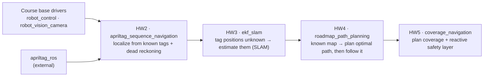
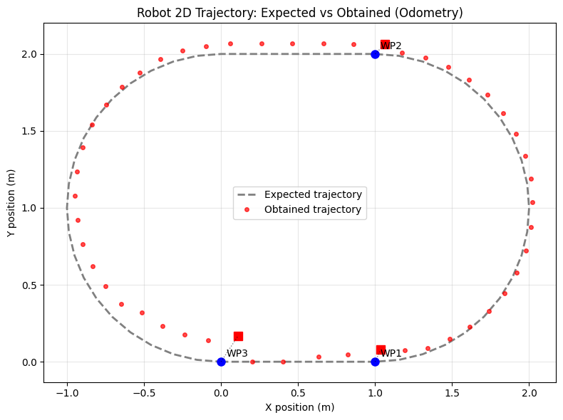
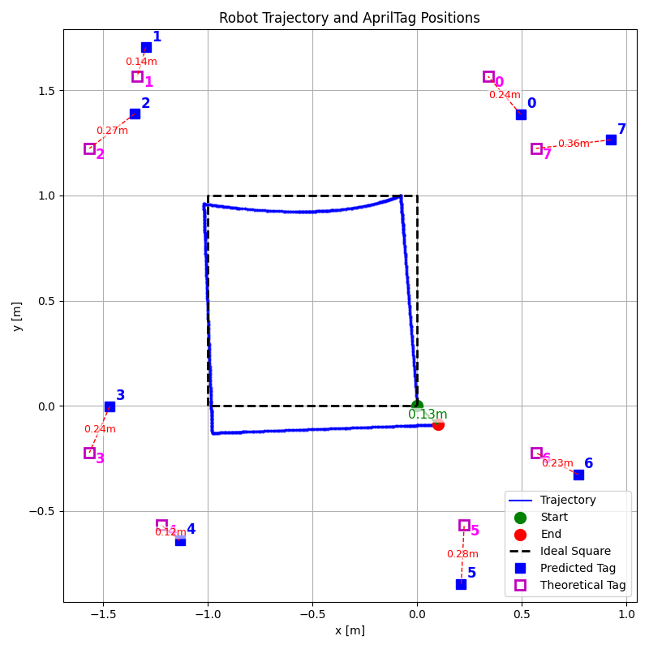
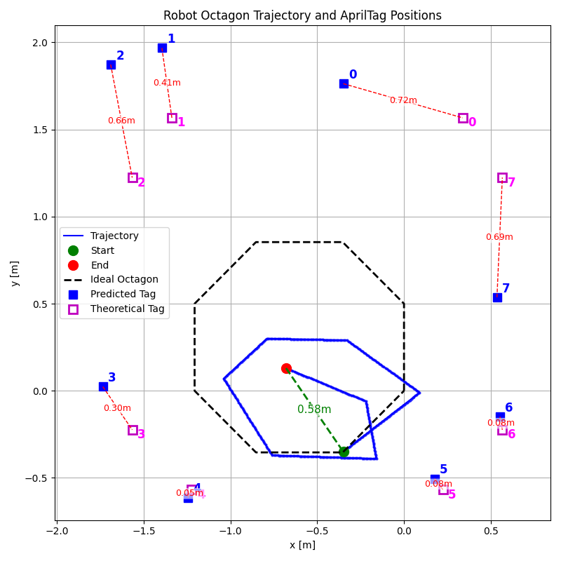
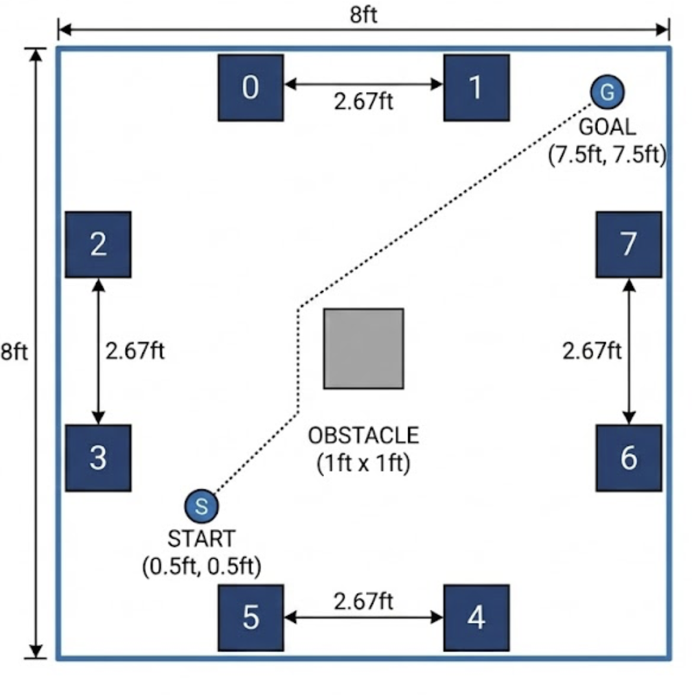
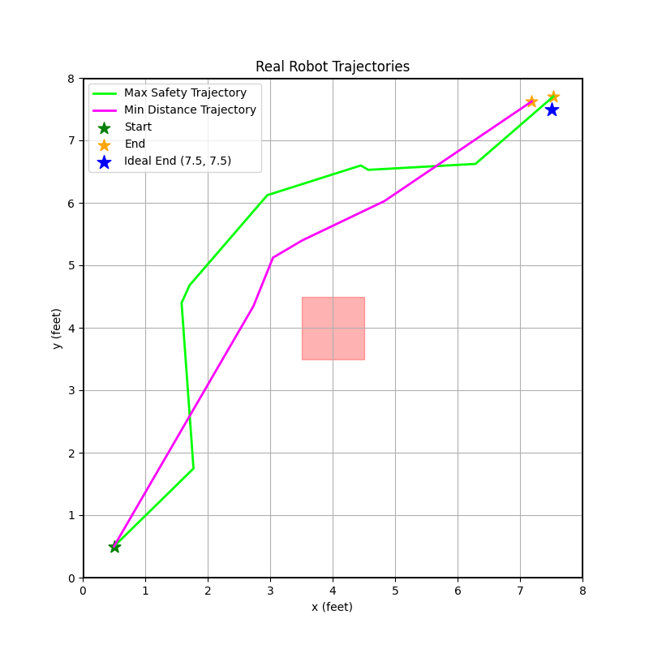
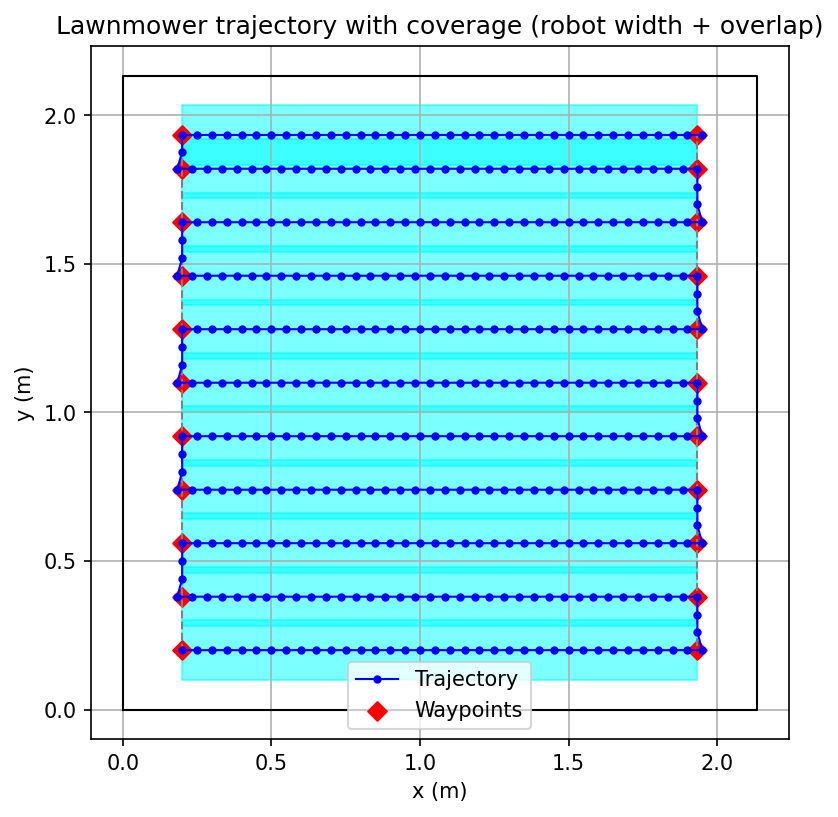
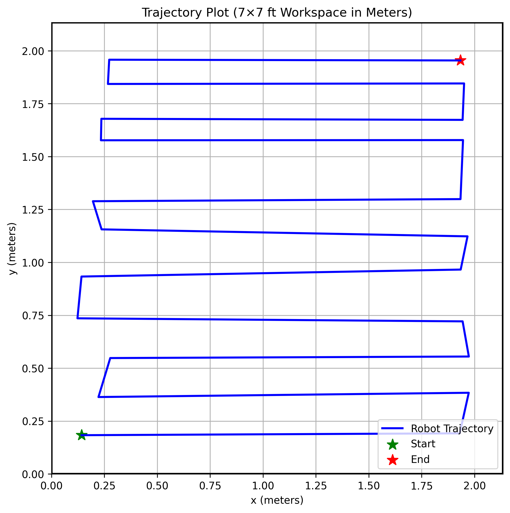
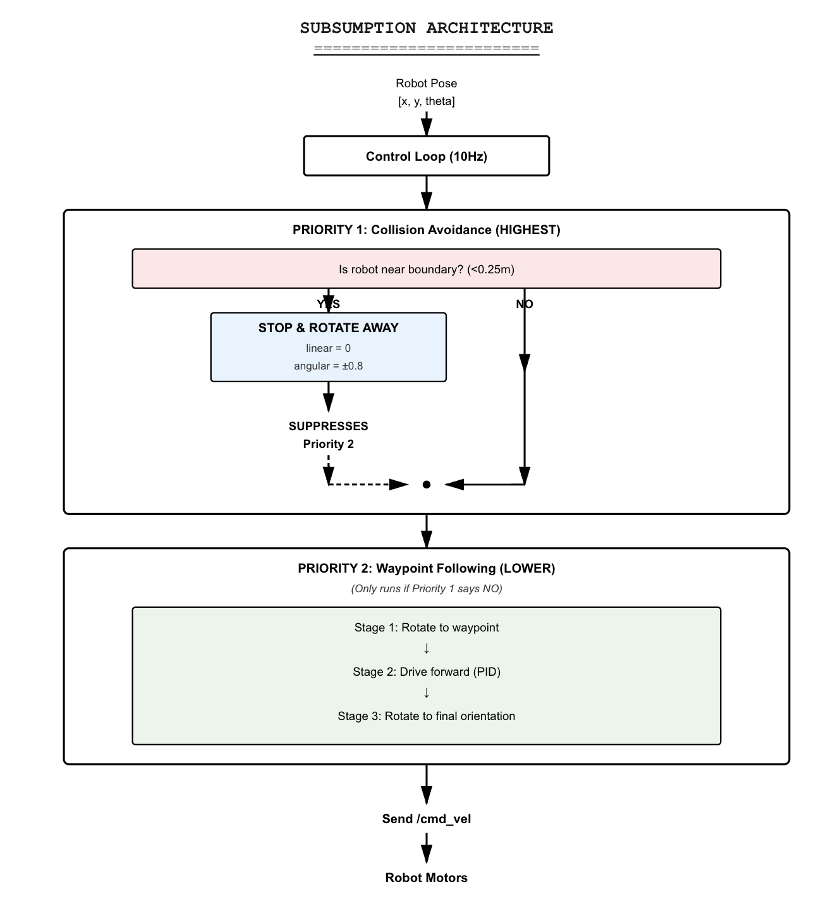

# ROS 2 EKF-SLAM & Path Planning on a Real Robot

**Four ROS 2 packages, each one adding a new autonomy capability to a small differential-drive robot (RubikPi): AprilTag-corrected waypoint navigation, EKF-SLAM, roadmap path planning, and full-area coverage with a subsumption controller.**

Built by **Sergi Marsol** and **Yule Zhang** for UCSD CSE 276A (Introduction to Robotics, Fall 2025), homeworks 2–5. Every package was run on the physical robot, and the figures below come from those runs.

---

## Overview

The course gave each team the same robot and the same base drivers: a serial motor controller and a camera node. Each homework then asked for a harder autonomy task. This repository brings the four solutions together in **one colcon workspace**. Each solution is its own package, with its own name, launch file and results, so you can tell them apart at a glance.

| # | Package | Capability | Key algorithm(s) | Launch command | Result figure |
|---|---------|------------|------------------|----------------|---------------|
| HW2 | [`apriltag_sequence_navigation`](src/apriltag_sequence_navigation) | Drive a calibrated closed loop (1 m straight, 180° arc, 1 m straight, 180° arc) and correct drift with AprilTags | Calibrated time-based feed-forward + dead reckoning + AprilTag pose correction (4 s correction timeout) | `ros2 launch apriltag_sequence_navigation sequence_navigation.launch.py` | [expected vs obtained](figures/hw2_trajectory_expected_vs_obtained.png) |
| HW3 | [`ekf_slam`](src/ekf_slam) | Estimate the robot pose **and** an unknown number of AprilTag landmarks at the same time | Extended Kalman Filter SLAM (range–bearing measurements, state augmentation when a new landmark appears) | `ros2 launch ekf_slam ekf_slam_node.launch.py` | [square](src/ekf_slam/output/trajectory_square_plot.png), [octagon](src/ekf_slam/output/trajectory_octagon_plot.png) |
| HW4 | [`roadmap_path_planning`](src/roadmap_path_planning) | Plan around an obstacle from start to goal, optimizing either **shortest distance** or **maximum clearance**, then execute the plan | Probabilistic roadmap (2000 samples, k-NN graph) + Dijkstra with two edge-cost functions + Ramer–Douglas–Peucker simplification | `ros2 launch roadmap_path_planning roadmap_navigation_node.launch.py` | [both executed paths](src/roadmap_path_planning/output/final_trajectories.png) |
| HW5 | [`coverage_navigation`](src/coverage_navigation) | Sweep a whole 7 × 7 ft arena without leaving it | Lawnmower coverage planner (10 % row overlap) + two-layer subsumption architecture (virtual-boundary avoidance overrides waypoint following) | `ros2 launch coverage_navigation coverage_navigation_node.launch.py` | [executed coverage path](src/coverage_navigation/output/trajectory_plot_meters.png) |

Supporting packages (not our work):

| Package | Role |
|---------|------|
| [`robot_control`](src/robot_control) | **Course-provided** base driver: serial motor controller and keyboard teleop for the RubikPi robot |
| [`robot_vision`](src/robot_vision) (ROS package name `robot_vision_camera`) | **Course-provided** C++ camera node (H.264 from shared memory → `/camera/image_raw`, plus a Foxglove bridge) |
| `apriltag_ros` | **External dependency** (Christian Rauch's AprilTag ROS 2 node, as distributed by the course). It is **not** included here; see [Getting started](#getting-started) |

### How the packages build on each other



- **HW2:** the tag positions are known and the robot localizes against them.
- **HW3:** the tag positions are *unknown*. The EKF estimates the map and the robot pose together.
- **HW4:** with a known map, the question becomes *where to go*. The planner builds a roadmap and searches it under two different objectives.
- **HW5:** the goal becomes covering the whole area. A reactive safety layer can override the planned path.

All four packages share the same ROS 2 interface pattern: `camera → apriltag_ros (/detections, /tf) → our node → /cmd_vel or motor_commands → motor_control → serial`.

---

## What we built

### HW2: `apriltag_sequence_navigation`: closed-loop waypoint navigation
- **Calibrated feed-forward motion.** The `SequenceController` drives the loop with wheel-speed/duration pairs that we calibrated on the robot. The turns are smooth 1 m-radius arcs, not in-place spins.
- **Pose from tags.** The `AprilTagMap` holds four tags at known world poses. Each detection on `/detections` gives a robot-pose estimate, which applies small corrective wheel commands.
- **Dead-reckoning fallback.** If no tag has been seen for 4 s (`tag_timeout = 4.0`), the node falls back to kinematic dead reckoning. It also publishes `odom → base_link` on `/tf`.
- **Direct wheel commands.** This node bypasses `velocity_mapping` and publishes `[L, R]` wheel commands straight to `motor_commands`.

### HW3: `ekf_slam`: EKF-SLAM with an unknown number of landmarks
- **`EKFSLAM` class.** It holds the state `[x, y, θ, l1x, l1y, …]` and a full covariance matrix.
  - The motion noise depends on the commanded velocity.
  - The measurement noise depends on whether the robot is moving or turning (`get_measurement_noise`).
- **New and returning tags.**
  - A tag seen for the first time is **added to the state**, and its covariance is initialized by propagating the robot and measurement uncertainty (`_initialize_landmark`).
  - A tag seen again is fused with a standard EKF update, using the Joseph-form covariance update kept symmetric.
- **Range–bearing measurements.** These come from the `/tf` transform between the camera and each tag. `camera_tf` publishes the static camera mount.
- **Saved trajectories.** The node logs the EKF, dead-reckoning and midpoint trajectories and the final landmark map to CSV. `plot_trajectory_square.py` and `plot_trajectory_octagon.py` compare them against the measured ground-truth tag positions.

### HW4: `roadmap_path_planning`: minimum-distance vs maximum-safety planning
- **Two planners.** `minimum_distance_trajectory.py` and `maximum_safety_trajectory.py` build the same probabilistic roadmap: 2000 uniform samples, obstacle rejection, a KD-tree k-nearest-neighbour graph, and a length and clearance stored for every edge. Dijkstra then searches it with one of two edge costs:
  - Euclidean length, for **minimum distance**.
  - `1 / clearance`, for **maximum safety**.
- **Simplification.** Ramer–Douglas–Peucker (ε = 0.3) turns the dense path into a few waypoints. These are written to `output/trajectory_waypoints_*.csv`.
- **Execution.** `roadmap_navigation_node` follows the waypoints with a three-stage PID controller (rotate to goal → drive → rotate to final heading). It localizes from the known tag poses in `configs/apriltags_position.yaml`: eight perimeter tags plus four on the faces of the central obstacle. Dead reckoning fills in between.

### HW5: `coverage_navigation`: lawnmower coverage + subsumption
- **Coverage path.** `lawnmower_trajectory.py` generates straight sweep rows spaced at 90 % of the robot width (10 % overlap), with a wall margin of robot radius + 5 cm. It writes the turn points to `output/turn_waypoints.csv`.
- **Two-layer subsumption.** `coverage_navigation_node` runs this every control step:
  - **Layer 1 (highest priority):** a `VirtualObstacleDetector` watches the distance to the 7 × 7 ft arena walls. Within 0.25 m of a wall it suppresses everything else, stops the robot and rotates it away from the nearest wall.
  - **Layer 2:** waypoint following with the same rotate–drive–rotate PID structure as HW4.
- **Localization.** It uses the same AprilTag localization as HW4, with eight tags at known poses (`configs/apriltags_position.yaml`).

---

## Results

All numbers come from the CSV/PNG files in this repository or from our homework reports.

### HW2: AprilTag-corrected loop


| Waypoint | Position error (m) | Orientation error (°) |
|---|---|---|
| WP1 | 0.06 | 3 |
| WP2 | 0.09 | 7 |
| WP3 (back at start) | 0.20 | 5 |
| **Mean** | **0.12** | **5.0** |

The robot travelled about 8.4–8.6 m (odometry 8.57 m, dead reckoning 8.41 m), against 8.28 m in theory. The error grows towards the end of the loop because drift accumulates between tag corrections. *(Source: HW2 report, Tables 2–3.)*

### HW3: EKF-SLAM (square and octagon trajectories)
| Square (1 m side) | Octagon |
|---|---|
|  |  |

- **Square run.** All **8 landmarks** were discovered and mapped, without the filter being told how many there were. Each plot shows the error of every estimated tag against its measured position.
  - Square: 0.12–0.36 m, mean ≈ 0.24 m.
  - Start-to-end gap: 0.13 m.
- **Octagon run.** Also 8 landmarks, but the map is less accurate: 0.05–0.72 m per tag, mean ≈ 0.37 m. The start-to-end gap is 0.58 m, because the robot's executed octagon drifted from the ideal shape.

*(Source: `src/ekf_slam/output/*.png` and `*_tags.csv`. The means are computed from the per-tag errors printed in the plots. We have no written HW3 report in this repository.)*

### HW4: Minimum distance vs maximum safety
| Arena (8 × 8 ft, 1 × 1 ft obstacle, 8 tags) | Both executed trajectories |
|---|---|
|  |  |

| Objective | Simplified waypoints | Executed end point (ft) | Final error vs goal (7.5, 7.5) ft |
|---|---|---|---|
| Maximum safety | 6 (incl. start & goal) | (7.53, 7.70) | 0.204 ft (≈ 6 cm) |
| Minimum distance | 3 (incl. start & goal) | (7.19, 7.62) | 0.337 ft (≈ 10 cm) |

The roadmap plots, with both paths drawn over the PRM, are in [`roadmap_with_both_paths_max_safety.png`](src/roadmap_path_planning/output/roadmap_with_both_paths_max_safety.png) and [`roadmap_with_both_paths_min_distance.png`](src/roadmap_path_planning/output/roadmap_with_both_paths_min_distance.png). *(Sources: `src/roadmap_path_planning/output/*.csv` and the HW4 report §4.2.)*

### HW5: Coverage with a subsumption architecture
| Planned lawnmower path | Executed path (real robot) | Control architecture |
|---|---|---|
|  |  |  |

On the real robot, the executed path follows the full sweep pattern across the 7 × 7 ft (2.13 m) arena and stays inside it. The boundary layer took over whenever the robot came within 0.25 m of a virtual wall. We estimated, by visual inspection and not by measurement, that about **80 % of the arena** was covered. The gaps are near the walls, which the safety layer deliberately keeps the robot away from, and where sweep rows came out unevenly spaced. *(Source: HW5 report §3.)*

---

## Tech stack
- **ROS 2** (`rclpy`, `launch`, `tf2_ros`, `geometry_msgs`, `sensor_msgs`, `apriltag_msgs`), built with colcon / ament_python. The camera driver uses ament_cmake/C++.
- **Python:** NumPy, SciPy (`KDTree`, `Rotation`), pandas, Matplotlib, PyYAML, pySerial.
- **Perception:** AprilTag family **Standard41h12** (0.1524 m tags) via `apriltag_ros`.
- **Hardware:** RubikPi differential-drive robot with an onboard camera and a serial motor controller.

## Repository structure
```
.
├── figures/                         # figures extracted from our HW2/HW4/HW5 reports
└── src/
    ├── apriltag_sequence_navigation/  # HW2 – closed-loop sequence navigation
    ├── ekf_slam/                      # HW3 – EKF-SLAM  (output/: CSV logs + plots)
    ├── roadmap_path_planning/         # HW4 – PRM + Dijkstra planners (output/: paths, logs, plots)
    ├── coverage_navigation/           # HW5 – lawnmower coverage + subsumption (output/)
    ├── robot_control/                 # course-provided motor driver + teleop
    └── robot_vision/                  # course-provided camera driver (pkg: robot_vision_camera)
```
Each of our four packages contains the same structure:
- its main node;
- a `camera_tf` static-transform publisher;
- a `velocity_mapping` node (Twist → wheel commands, calibrated per homework);
- its own copy of `motor_control`;
- a `configs/` folder with the tag poses.

They are kept self-contained on purpose, so that each homework stays reproducible.

## Getting started

> **Hardware required.** These nodes drive a real robot over a serial port and read from the RubikPi camera's shared memory, so they will not run on a laptop as they are. The offline planners and plotting scripts (HW4/HW5) do run anywhere with Python.

**1. Workspace.** The launch files expect the workspace at `~/ros2_ws`. They load `~/ros2_ws/src/robot_vision/config/camera_parameter.yaml`, and the EKF/coverage nodes write their logs under `~/ros2_ws/src/<pkg>/output`. So clone this repository *as* that workspace:
```bash
git clone https://github.com/sergimarsol/ROS2-EKF-SLAM-Path-Planning.git ~/ros2_ws
cd ~/ros2_ws
```

**2. Add `apriltag_ros`.** It is not included here. Use the version distributed with the course, or the upstream [christianrauch/apriltag_ros](https://github.com/christianrauch/apriltag_ros). Our launch files include `apriltag_ros/launch/apriltag_launch.py` with `config_file:=tags_standard41h12.yaml`.
- The course version ships that launch file.
- With upstream you must add it, and also copy [`src/ekf_slam/configs/tags_standard41h12.yaml`](src/ekf_slam/configs/tags_standard41h12.yaml) into `apriltag_ros/cfg/`.
```bash
git clone https://github.com/christianrauch/apriltag_ros.git src/apriltag_ros   # or copy the course version
cp src/ekf_slam/configs/tags_standard41h12.yaml src/apriltag_ros/cfg/
```

**3. Build.** Use `--symlink-install`: the HW5 node finds its waypoint CSV relative to the package source.
```bash
rosdep install --from-paths src --ignore-src -y
colcon build --symlink-install
source install/setup.bash
```

**4. Run one capability at a time:**
```bash
# HW2 – only starts navigation + motor driver; start the camera and AprilTag nodes first:
ros2 launch robot_vision_camera robot_vision_camera.launch.py image_rectify:=true
ros2 launch apriltag_ros apriltag_launch.py config_file:=tags_standard41h12.yaml
ros2 launch apriltag_sequence_navigation sequence_navigation.launch.py

# HW3 – EKF-SLAM (starts camera, AprilTag, drivers and the SLAM node with staggered timers)
ros2 launch ekf_slam ekf_slam_node.launch.py

# HW4 – plan offline, then execute
python3 src/roadmap_path_planning/roadmap_path_planning/minimum_distance_trajectory.py
python3 src/roadmap_path_planning/roadmap_path_planning/maximum_safety_trajectory.py
ros2 launch roadmap_path_planning roadmap_navigation_node.launch.py

# HW5 – generate the lawnmower path, then execute
python3 src/coverage_navigation/coverage_navigation/lawnmower_trajectory.py
ros2 launch coverage_navigation coverage_navigation_node.launch.py

# Base driver sanity check (course-provided keyboard teleop)
ros2 launch robot_control robot_teleop_launch.py
```

**5. Re-plot results** from the logged CSVs:
```bash
python3 src/ekf_slam/ekf_slam/plot_trajectory_square.py
python3 src/ekf_slam/ekf_slam/plot_trajectory_octagon.py
python3 src/roadmap_path_planning/roadmap_path_planning/plot_trajectories.py
python3 src/coverage_navigation/coverage_navigation/plot_trajectory.py
```

**Notes and caveats:**
- The HW3/HW4/HW5 launch files start with a cleanup step that runs `sudo pkill` on stale camera processes, so they expect passwordless sudo on the robot.
- The `ekf_slam` node ships with the **square** movement sequence (`self.movements`). Change that list to drive the octagon.
- `roadmap_navigation_node` has the **maximum-safety** waypoints hard-coded, in feet. To run the other plan, paste in the contents of `output/trajectory_waypoints_min_distance.csv` and change the `output_csv` name.
- The `ekf_slam` copy of `motor_control` has the course driver's 0.15 s command-timeout safety stop **disabled**, for uninterrupted SLAM runs. Keep the robot within reach.

---

## Team & acknowledgements
- **Sergi Marsol** and **Yule Zhang**: design, implementation, calibration, experiments and reports for all four packages (pair work).
- **UCSD CSE 276A course staff** provided the RubikPi robot, the base drivers (`robot_control`, `robot_vision`), the AprilTag TF instructions (`TF_AprilTag_Instructions.txt`) and the assignment specifications.
- AprilTag detection: [`apriltag_ros`](https://github.com/christianrauch/apriltag_ros) by Christian Rauch, built on the [AprilTag library](https://april.eecs.umich.edu/software/apriltag) from the University of Michigan.

## License
[MIT](LICENSE) © 2026 Sergi Marsol and Yule Zhang. The course-provided base drivers in `src/robot_control` and `src/robot_vision` belong to their original authors and are included only so that the workspace builds.
